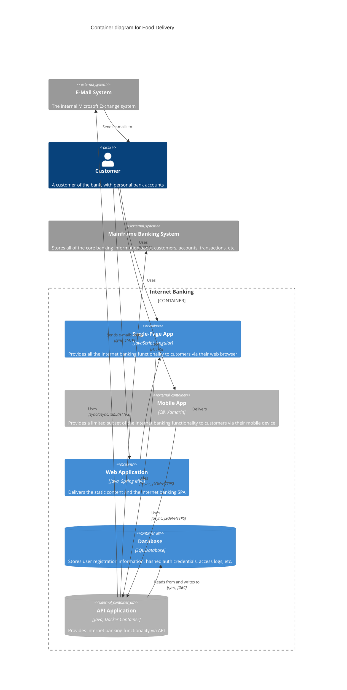

# Food Delivery
[](https://github.com/wkrzywiec/food-delivery-app/actions/workflows/build.yaml)  [](https://sonarcloud.io/summary/new_code?id=wkrzywiec_food-delivery-app) [](https://sonarcloud.io/summary/new_code?id=wkrzywiec_food-delivery-app) 

This is a sandbox application for me to try out new concepts and technologies.

## Usage

### With Taskfile
The easiest way to start working with a project is to run one of the tasks from the Taskfile:

```bash
task -l
```

Exemplary output:

```
* check:        Verify local tools
* dev:backend:  Run backend apps with gradle
* infra:        Spin up dockerized infrastructure
* infra:clean:  Stop and clean all persisted data
* infra:down:   Stop infrastructure
* init:         Run all services in Docker & add initial data
* run:          Run all services in Docker
```

In example, in order to run all services with initial data, run the command:

```bash
task init
```

### With `docker compose`

If you prefer not to install or use Taskfile, you can easily run all services with a simple command:
```bash
docker compose up -d
```

To explore the additional commands available in the Taskfile, please refer to the `Taskfile.yaml` file.

## Requirements

o run all services on your local machine, you will need to have Docker installed.

To develop either a backend or frontend service, you will need the following software installed:

* Java
* npm and Node
* Taskfile

Please note that specific versions of each software can be found within each service.

## Configuration

## Project description

The Food Delivery app is designed as a microservice system, aiming to replicate real-world solutions in a simplified manner.

As this project serves as my sandbox for experimenting with new concepts and technologies, it will continue to evolve over time. Initially, it primarily functions as an event-driven system, with services communicating with each other based on events.

### C4 model


